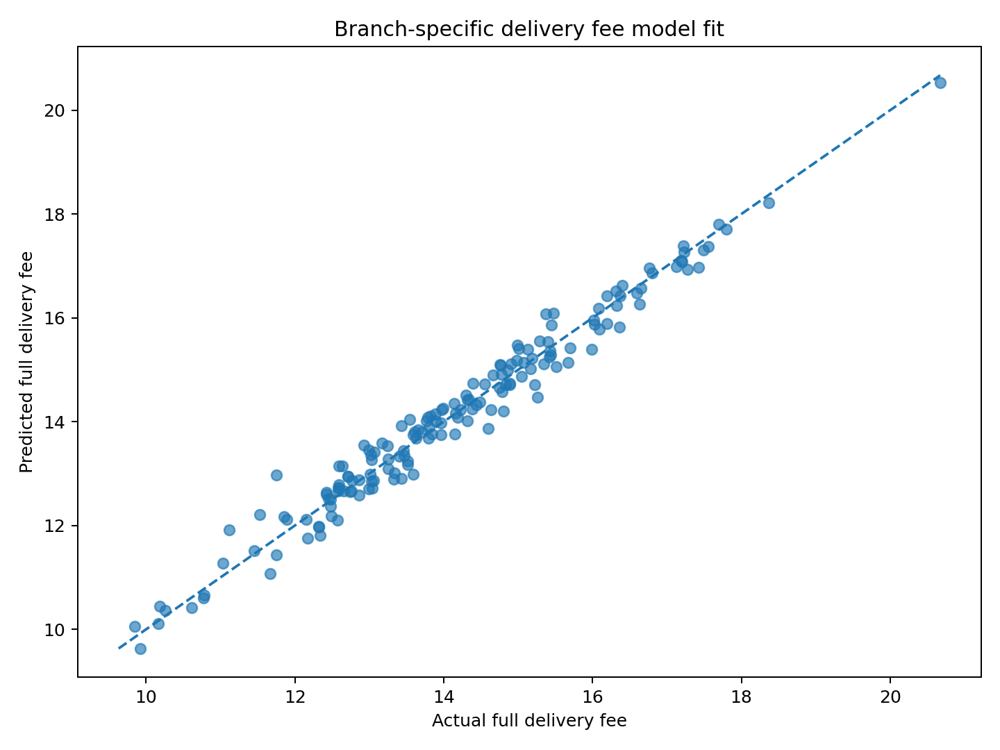
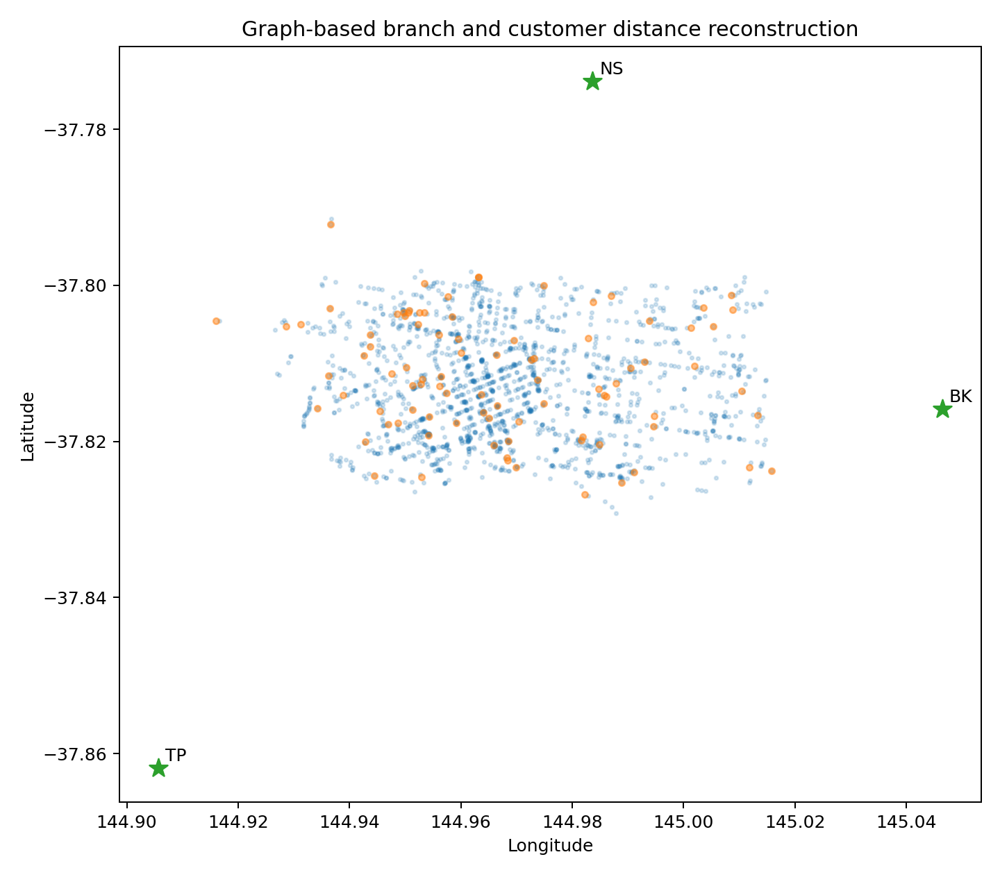
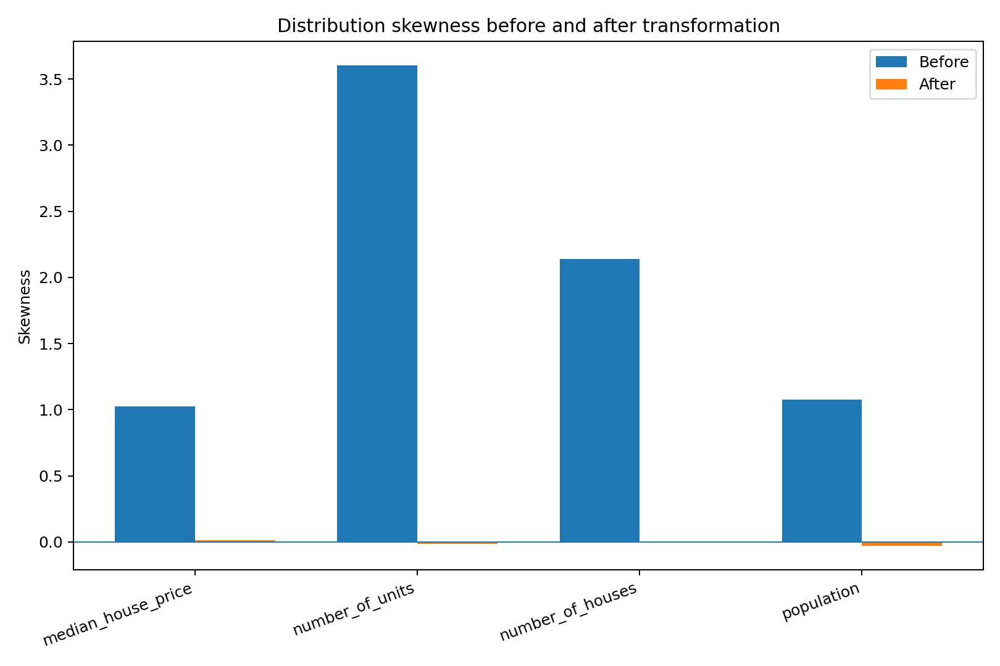
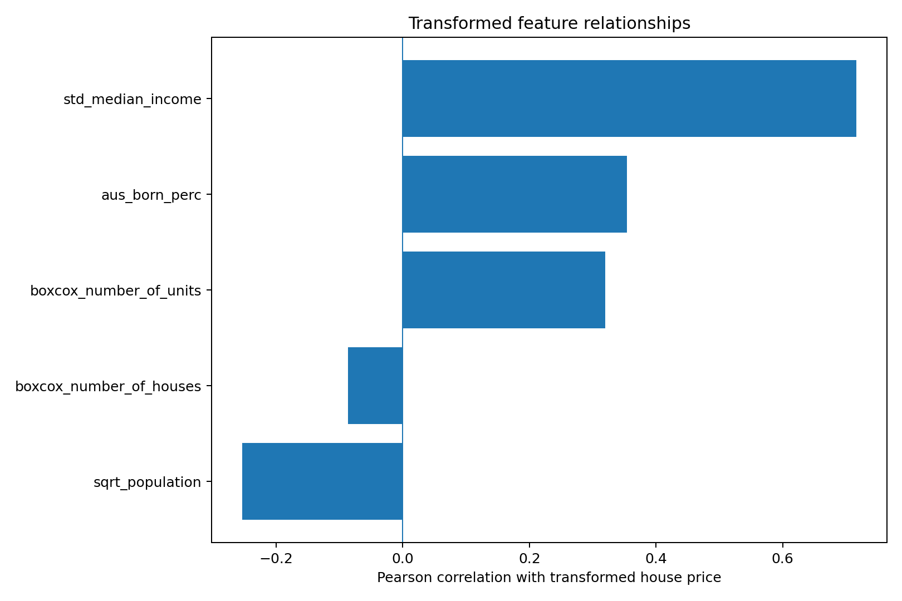

# Urban Data Quality & Feature Engineering

A team-developed Python project for repairing operational data, reconstructing geospatial features and preparing skewed socioeconomic variables for statistical modelling.

The project combines two applied analytics workflows: a food-delivery data quality pipeline and a Melbourne suburb feature-transformation pipeline. The implementation emphasizes transparent business rules, reproducible modelling and interpretable diagnostics.

## Team

Developed collaboratively by **Minnie Dang** and **Tsai-Ling Hsu**.

## Technical highlights

- Rule-based repair of inconsistent dates, branch identifiers, service-period labels, menu items, order totals, customer coordinates and loyalty flags.
- Menu-price recovery through linear algebra and order-level price reconstruction.
- Road-network modelling with **NetworkX** and **Dijkstra shortest paths** for branch assignment and delivery-distance reconstruction.
- Branch-specific **Linear Regression** models for delivery-fee imputation using distance, service period and weekend effects.
- Loyalty-discount adjustment and robust residual-based delivery-fee outlier detection.
- Currency and percentage parsing for Melbourne suburb data.
- Comparative feature reshaping with **Z-score standardisation**, **Box–Cox transformation** and square-root transformation.
- Pearson correlation and multicollinearity diagnostics for regression-ready feature selection.

## Reference results

- **35 injected data-quality anomalies** repaired across seven validation categories.
- **51 missing fields** reconstructed or model-imputed.
- **15 injected delivery-fee outliers** detected and removed.
- Branch-level delivery-fee model R² ranged from **0.933 to 0.984**.
- **202 Melbourne suburbs** processed through the feature-engineering workflow.
- Standardised median income had the strongest relationship with transformed house price: **Pearson r = 0.716**.
- Maximum absolute pairwise correlation among selected predictors was **0.609**, indicating no severe multicollinearity in the transformed feature set.

## Visual analysis

### Branch-specific delivery-fee model fit



### Graph-based distance reconstruction



### Distribution transformation effectiveness



### Transformed feature relationships



## Technology

`Python` · `Pandas` · `NumPy` · `NetworkX` · `SciPy` · `Scikit-learn` · `Matplotlib`

## Run locally

```bash
pip install -r requirements.txt
python run_pipeline.py
```

The pipeline generates cleaned delivery datasets, model metrics, transformed suburb features and analytical figures. The included data are anonymized portfolio samples with a reduced road-network extract for reproducible execution.

## Scope

The delivery-fee models are operational data-quality tools rather than production pricing systems. Geospatial assignments depend on the available road-network extract, while property transformations are intended to prepare variables for subsequent modelling rather than establish causal relationships.

## License

MIT License.
